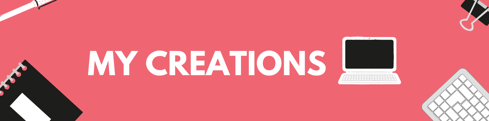

    
  <h3>
    <strong>Desafios de Frontend Mentor by [Laura Luque](https://github.com/MiauraDev)</strong>
  </h3>

## ✨ Proyectos

| #   | Proyecto     | Descripción                   | Código                                                                                                                                      | Website                                                                                                                             | Tools        |
| --- | ------------ | ----------------------------- | ------------------------------------------------------------------------------------------------------------------------------------------- | ----------------------------------------------------------------------------------------------------------------------------------- | ------------ |
| 1   | **EasyHotel**| Bento Grid EasyHotel.pe      |           |           |  |
| 2   | **Rezero**   | Bento Grid venta Re:Zero     |           |          | |
| 3   | **Starbucks**| Landing Page Starbucks       |        |       |
   |
| 4   | **Guess**    | Guess My Age game            |                       |                      |  |

